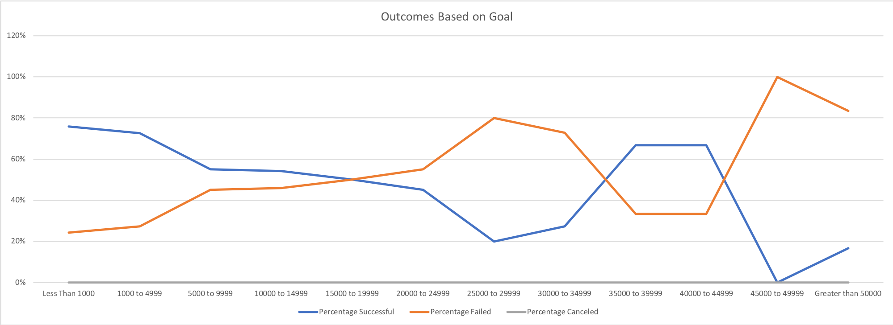

# Kickstarting with Excel

## Overview of Project

### Purpose

The purpose of this project is to analyze Kickstarter data in order to identify factors that lead to successful crowdfunding campaigns. 

## Analysis and Challenges

### Analysis of Outcomes Based on Launch Date

By filtering the data to show outcomes for the theater Kickstarters throughout the year, we can conclude that the months with the highest counts of successful campaigns were May, with 111, and June, with 100. Additionally, we can identify that the month of December has the least amount of successful campaigns at 37, which is almost equal to the amount of failed campaigns at 35. This indicates that the probability of succeeding a campaign launched in December is almost the same as the probability of failing one. 

While the months of May and June also have the some of the highest counts of failed campaigns at 52 and 49, respectively, the data shows that the likelihood of succeeding after launching during these months is double than the likelihood of failing. 

### Analysis of Outcomes Based on Goals

By filtering the Kickstarter data to include only musicals, we can further breakdown rate of success for campaigns based on their crowdfunding goal. It is shown that the most successful campaigns had a goal of less than $1000, with a success rate of 76% across 186 total projects within that goal range. Following this, the data shows that as the goal amount increased, the counts of successful projects steadily decrease and counts of failed projects slowly increase. The probability of success and failure is 1:1 when the campaign goal is between $15000-19999. Following this, there is great fluctation in succeeded and failed campaigns rates. This was likely impacted by the smaller amounts of total projects requiring higher crowdfunding goals.

### Challenges and Difficulties Encountered

A difficulty faced initially was combing through the data and looking only at the relevant data. The Kickstarter spreadsheet has many columns that were not important and, thus, added bulk to a spreadsheet that could have looked cleaner. I had to disregard data on currency, deadline, staff picks, and spotlight. 

## Results

The data in the "Outcomes Based on Launch Data" sheet shows that the best months to launch a campaign would be in May or June. It also shows that the worst month to launch a campaign would be in December. The "Outcomes Based on Goals" sheet shows that there is a higher likelihood for a successful campaign with a smaller crowdfunding goal. Still, the probability of succeeding a campaign with an approximate $10,000 budget as Louise outlined, is about 55%.

A limitation of the dataset is the small amount of crowdfunding campaigns with high goals. For example, the percentage successful was 67% for campaign goals of $35,000-39,999 and $40,0000-44,999. However, these only had 6 and 3 total projects, respectively. The sample size for these campaigns is significantly smaller than that for projects with smaller goals. This could affect the way that the data is presented and analyzed. 

It could also be beneficial to create a table that shows outcomes for musicals specific to the US based on launch date. This could help analyze when the best time to start the campaign in the US would be. 
